# 🔐 Secure File Sharing System with Integrity Verification and Access Control

A cloud-integrated secure file sharing web application that ensures confidentiality, integrity, and controlled access using AES-256 encryption, SHA-256 hashing, OTP-based authentication, and Google Drive cloud storage.

## 📌 Overview

This project provides a highly secure platform for file upload, storage, and sharing in a cloud environment. It addresses major security challenges such as unauthorized access, data breaches, and file tampering.

The system encrypts files using AES-256 before uploading them to Google Drive, ensuring that even if cloud storage is compromised, the data remains protected. It also integrates SHA-256 hashing for integrity verification and OTP-based Two-Factor Authentication (2FA) for enhanced user security.

Additionally, Role-Based Access Control (RBAC) is implemented to restrict access based on user roles, ensuring controlled and secure file sharing.

## 🚀 Features

- User Registration & Login  
- BCrypt Password Hashing  
- OTP-based Two-Factor Authentication (2FA)  
- AES-256 File Encryption & Decryption  
- SHA-256 Integrity Verification  
- Secure Cloud Storage (Google Drive)  
- OAuth2 Authentication for cloud access  
- Role-Based Access Control (RBAC)  
- Audit Logging & Monitoring  
- Secure File Upload & Download  

## 🛠 Tech Stack

- **Backend:** Java (JSP, Servlets)  
- **Frontend:** HTML, CSS, JavaScript  
- **Database:** MySQL  
- **Server:** Apache Tomcat  
- **Cloud:** Google Drive API  
- **Authentication:** OAuth2  

### 🔐 Security Technologies

- AES-256 (Encryption)  
- SHA-256 (Hashing)  
- BCrypt (Password Security)  
- OTP (2FA)  

## 🔄 Application Flow

1. User registers and logs into the system  
2. Password is securely stored using BCrypt hashing  
3. OTP is sent for Two-Factor Authentication  
4. User uploads file  
5. File is encrypted using AES-256  
6. SHA-256 hash is generated for integrity  
7. Encrypted file is stored in Google Drive via OAuth2  
8. Metadata and hash stored in database  
9. Authorized user requests download  
10. File is fetched from cloud storage  
11. SHA-256 hash is verified  
12. File is decrypted using AES-256  
13. Secure file is delivered to user  

## 📸 Screenshots

### 👤 User Module

#### Login
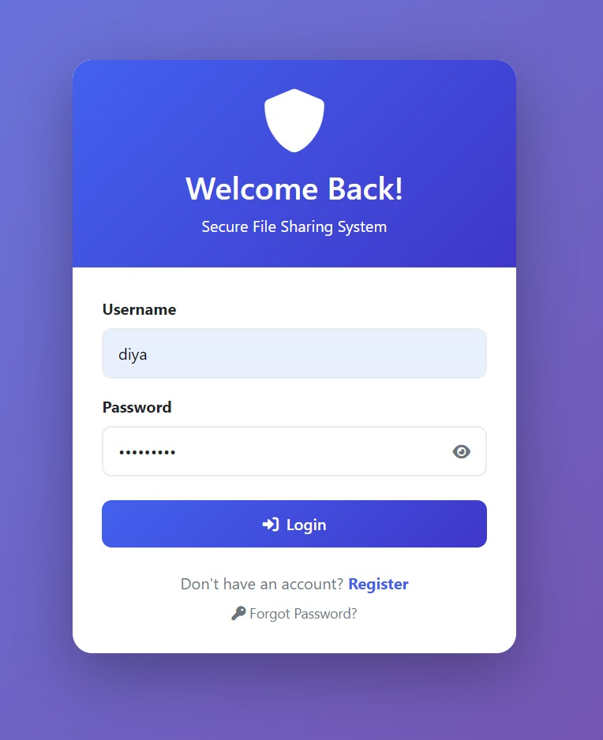

#### Register
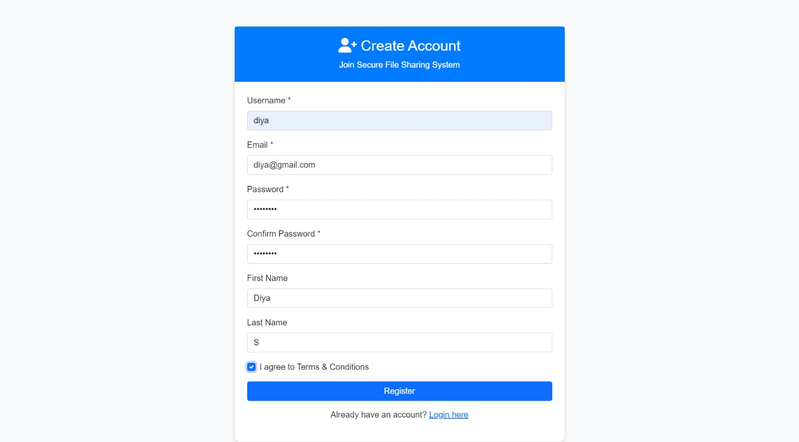

#### OTP Verification
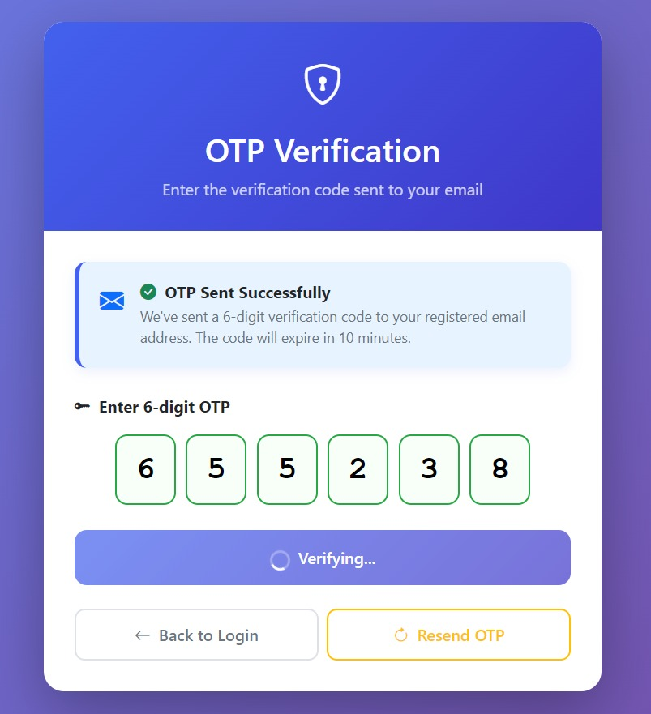

#### User Dashboard
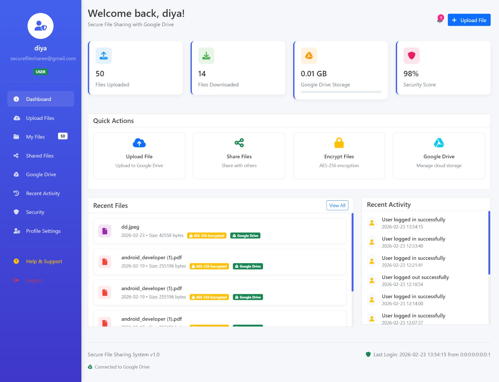

#### Upload File
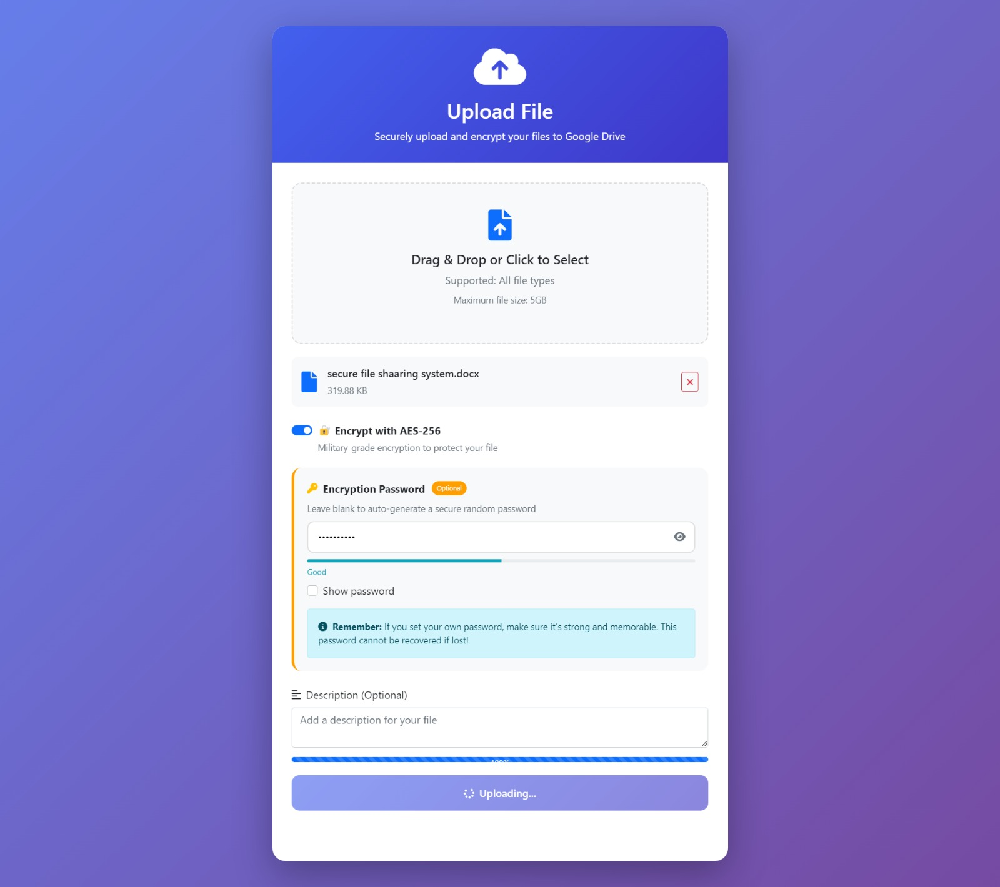

#### Upload Success
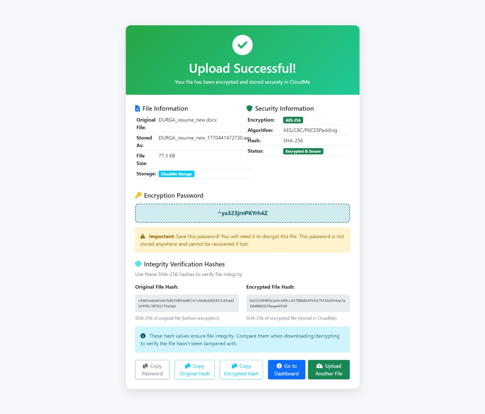

#### Download File
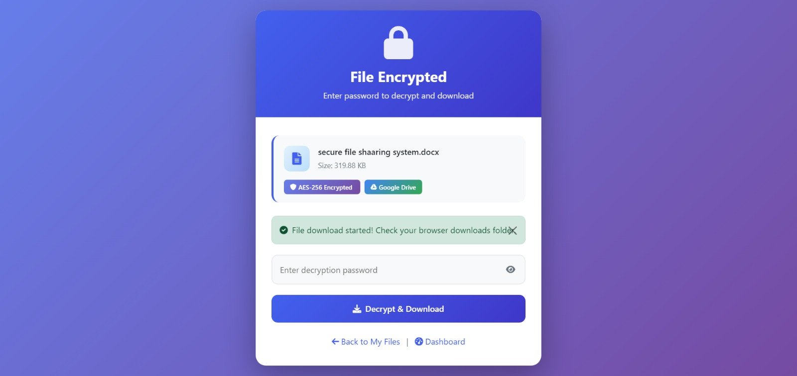

#### My Files
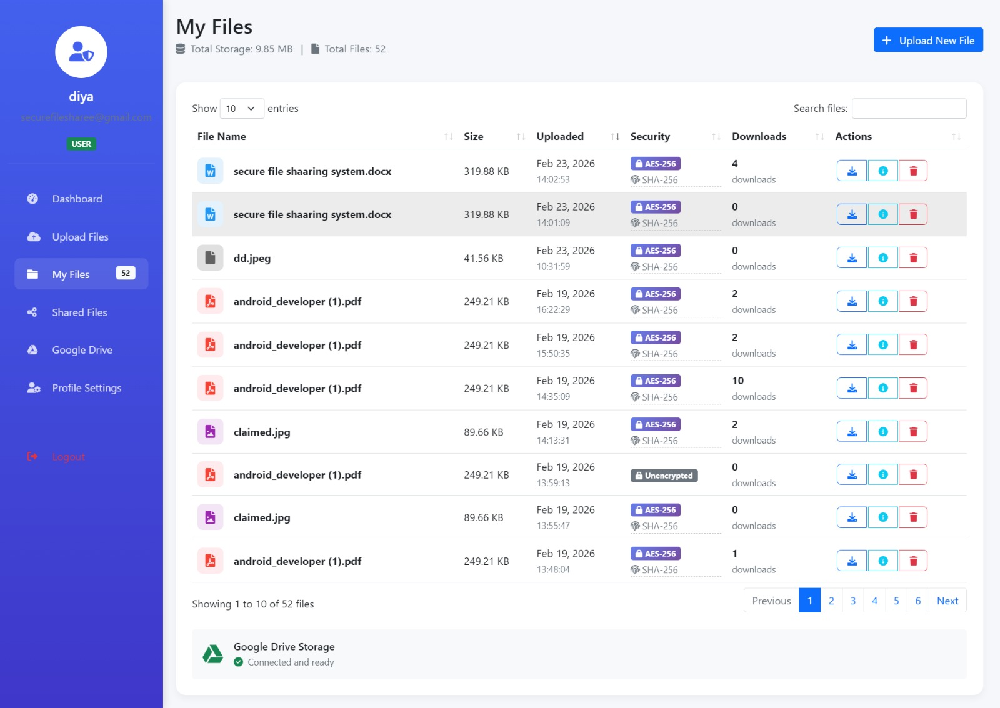

#### Shared Files
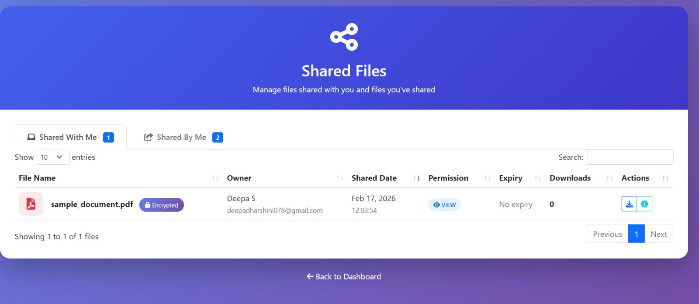

#### Recent Activity
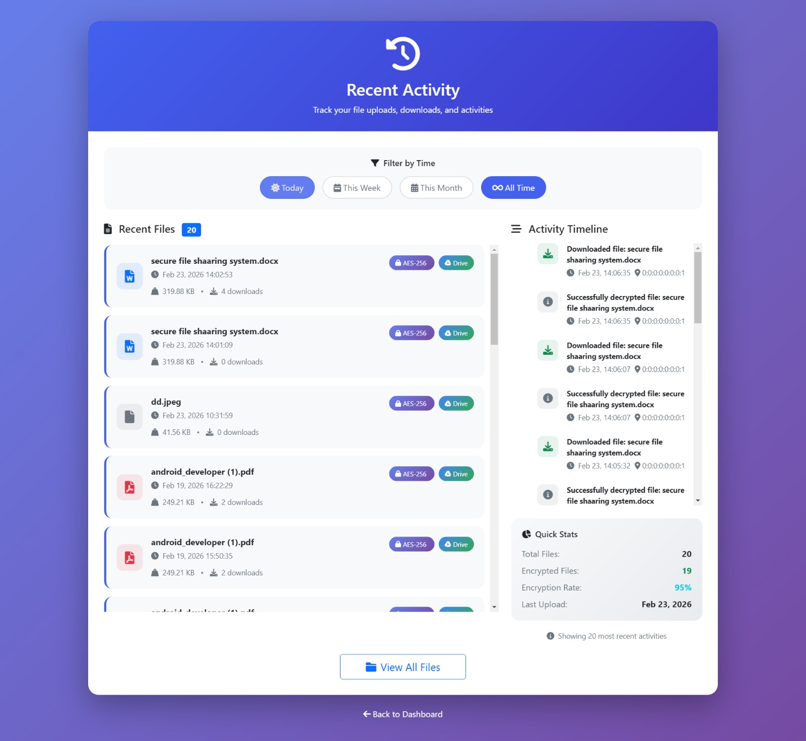

---

### 🛠 Admin Module

#### Admin Dashboard
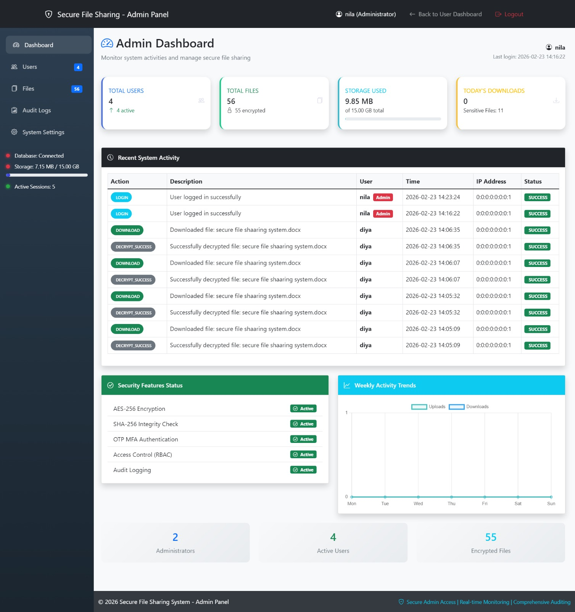

#### User Management
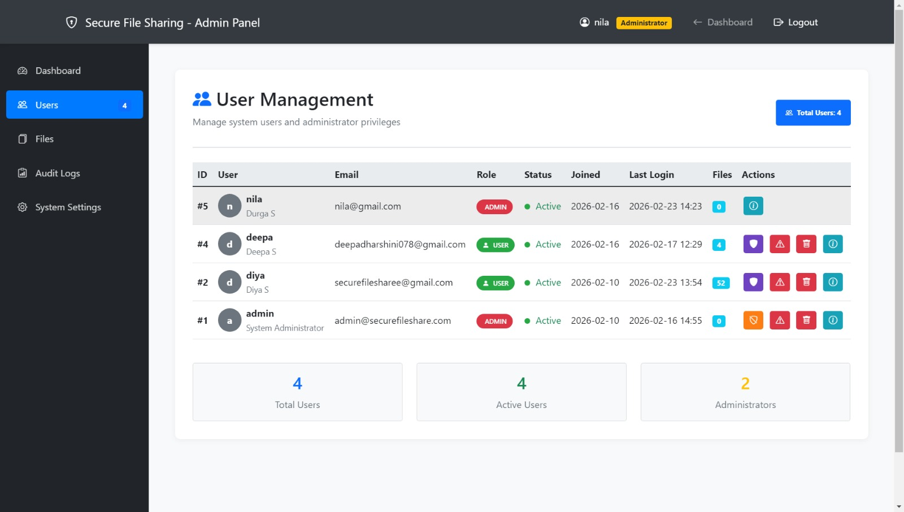

#### User Details

#### File Management
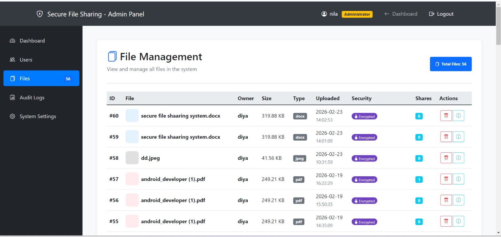

#### Audit Logs
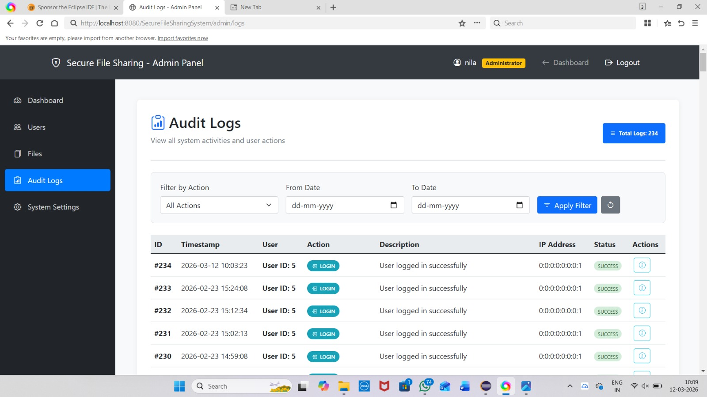

---

## 🏗 System Architecture

- Client–Server Architecture  
- Web Interface (JSP/Servlets)  
- Application Server Modules:
  - Authentication Module  
  - Encryption Module  
  - Integrity Verification Module  
  - Access Control Module  
- MySQL Database (credentials, metadata, hash values)  
- Google Drive Cloud Storage (encrypted files only)  

## 🔐 Security Implementation

- AES-256 encryption ensures file confidentiality  
- SHA-256 hashing ensures data integrity  
- BCrypt hashing protects user passwords  
- OTP-based 2FA prevents unauthorized access  
- RBAC restricts system operations based on roles  
- OAuth2 ensures secure cloud authentication  
- Zero-knowledge model (cloud stores only encrypted data)  

## ⚙️ Setup Instructions

1. Clone the repository  
2. Import project into Eclipse / IntelliJ  
3. Configure Apache Tomcat Server  
4. Setup MySQL database  
5. Configure Google Drive API credentials (OAuth2)  
6. Add credentials file to project  
7. Run the application  

## 📈 Future Enhancements

- Multi-cloud storage support  
- Biometric authentication  
- Blockchain-based integrity verification  
- Mobile application integration  
- Intrusion detection system  

## 👩‍💻 Author

**Deepadharshini S**  
Java Developer | Fresher  
Interested in Backend Development and Building Real-World Applications  

## ⭐ Support

If you found this project useful, consider giving it a ⭐ on GitHub.
